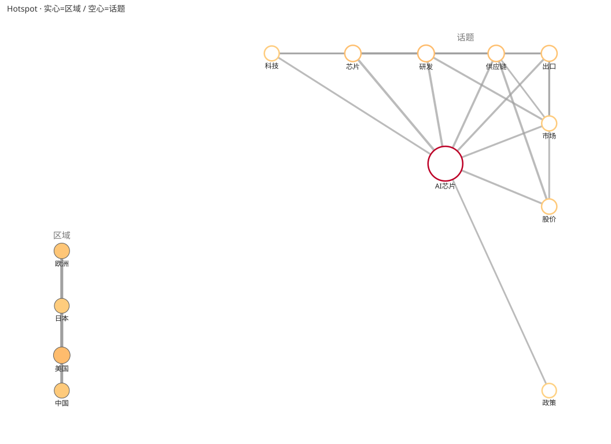

# HotSpot Pulse — 热点流量预测与情绪分析系统

[](https://github.com/wilberforce1900/hotspot-pulse/actions/workflows/ci.yml)


输入一个话题 tag，输出关联话题网络、短期增长预测（含置信区间）、情绪分布、
区域热度，并渲染热力网图。**纯 Python 标准库、零第三方依赖**，离线 MOCK 即可
端到端跑通；数据源适配器（RSS / GDELT / 自托管 RSSHub）开箱可选。



> 架构说明：本文前身为多代理协作预演的设计文档，阶段=委派单元的分工表述
> 保留在 §2–§5，现已全部落地为 `hotspot_pulse/` 包实现。

---

## 快速开始

```bash
cd hotspot-pulse
python main.py "AI芯片 24小时 中国"          # 直接跑（默认 MOCK + DAMPED，零依赖）
python -m hotspot_pulse.cli "AI芯片"        # 等价的模块方式调用
# 或安装为命令：
pip install . && hotspot "AI芯片"

# 运行测试（纯标准库 unittest，pytest 亦兼容）：
python -m unittest discover -s tests -v
```

- 输出：终端打印汇总报告（关联话题 / 增长预测 / 情绪分布 / 区域热度），并在 `out/` 生成 `hotspot.svg` 热力网图。
- 纯标准库，无网络、无第三方依赖即可端到端跑通。

---

## 0. 目录结构

```
hotspot-pulse/
├── main.py                    # 兼容薄壳入口（转发到 hotspot_pulse.cli）
├── pyproject.toml             # 打包配置（pip install . → hotspot 命令）
├── hotspot_pulse/             # 主包
│   ├── __init__.py            # 公共 API：run_pipeline / load_config
│   ├── cli.py                 # 命令行入口（argparse + --config/--json/--verbose）
│   ├── models.py              # 统一数据契约（dataclass 地基）
│   ├── config.py              # 配置加载（适配器/策略选择器）
│   ├── serialization.py       # PipelineResult → JSON 存档
│   ├── shared.py              # 跨阶段共享词典/常量/稳定哈希（单一来源）
│   └── stages/                # 流水线各阶段（委派单元，见下表）
├── tests/                     # 单元测试（unittest，覆盖各阶段 + 端到端）
└── out/                       # 运行产物（gitignore）
```

---

## 1. 目标（一句话）

输入**一个新 tag（话题）**，输出四样东西：

1. **关联话题网络**：该 tag 及关联话题，边权 = 关联度/共现度。
2. **短期增长预测**：未来 N 小时内的量/热度预测 + 增长信号（速度、加速度、破点）。
3. **情绪分析**：按话题、按区域聚合的正负/情绪类别分布。
4. **热度区域分布网图**：节点 = 区域（或话题），边 = 跨区传播 / 话题关联，
   节点大小/颜色编码热度 → 一张「热力网图」。

---

## 2. 总体流水线（阶段 = 委派单元）

```
[用户输入: 新 tag]
   │
   ▼
┌─ 阶段 0 · 输入解析与安全过滤 ─────────────┐   ←  V4 Pro 亲自
│ 解析 tag / 时间窗 / 地域范围 / 情绪维度；   │       · 委派前安全过滤（防注入/越权）
│ 产出标准化 Query。                        │       · 主模型自主，绝不委派
└──────────────────────────────────────────┘
   │
   ▼
┌─ 阶段 1 · 采集 DataIngestor ─────────────┐   ←  senior-coder
│ 多源采集（社交API/搜索/爬虫），统一 Post； │       · 适配器模式，可插拔数据源
│ 增量轮询 + 幂等去重。                     │
└──────────────────────────────────────────┘
   │
   ▼
┌─ 阶段 2 · 关联话题 TopicGraphBuilder ────┐   ←  general-reasoner（语义层）
│ 检测关联话题，构建 tag→related 图；        │       + senior-coder（聚合实现）
│ 边权 = 共现/语义相似。                    │
└──────────────────────────────────────────┘
   │
   ▼
┌─ 阶段 3 · 情绪 SentimentAnalyzer ────────┐   ←  general-reasoner（文本）
│ 文本情绪分类；可选图像表情多模态；         │   + multimodal-operator（图文混合时）
│ 按 topic/region 聚合。                   │
└──────────────────────────────────────────┘
   │
   ▼
┌─ 阶段 4 · 短期增长 GrowthPredictor ──────┐   ←  senior-coder（建模实现）
│ 时序预测（短窗口）；增长信号提取；         │   + V4 Pro（**核心算法亲自把关**）
│ 输出每话题未来量 + 置信度 + 破点。         │
└──────────────────────────────────────────┘
   │
   ▼
┌─ 阶段 5 · 区域热度 RegionHeatBuilder ────┐   ←  general-reasoner（地域归类）
│ 地理推断 → 按区域聚合热度；               │   + senior-coder（聚合实现）
│ 建区域节点 + 跨区传播边。                 │
└──────────────────────────────────────────┘
   │
   ▼
┌─ 阶段 6 · 热力网图 NetworkGraphRenderer ─┐   ←  visual-analyst
│ 渲染网图：节点=区域/话题，边=关联/传播；   │       · 图表/可视化专长
│ 节点大小/颜色=热度。                      │
└──────────────────────────────────────────┘
   │
   ▼
┌─ 阶段 7 · 报告合成与最终审核 ─────────────┐   ←  V4 Pro 亲自
│ 汇总预测+情绪+网图；一致性校验；拍板发布。  │       · 最终拍板权 / 安全审核
└──────────────────────────────────────────┘
```

---

## 3. 分工调度表（主模型 + 子代理）

| 阶段 | 模块文件 | 负责 | 输入 | 输出 | 是否核心逻辑 |
|---|---|---|---|---|---|
| 0 | `hotspot_pulse/stages/input_parser.py` | **V4 Pro 亲自** | 原始用户输入 | `Query` | 是（含安全过滤） |
| 1 | `hotspot_pulse/stages/collector.py` | senior-coder | `Query` | `Post[]` | 否（重但机械） |
| 2 | `hotspot_pulse/stages/topic_graph.py` | general-reasoner + senior-coder | `Post[]` | `TopicGraph` | 否（语义聚类可委派） |
| 3 | `hotspot_pulse/stages/sentiment.py` | general-reasoner / multimodal-operator | `Post[]` | `SentimentAgg` | 否（可委派） |
| 4 | `hotspot_pulse/stages/growth.py` | senior-coder(建模) + **V4 Pro 把关** | 时序数据 | `Prediction[]` | **是（V4 Pro 审定算法）** |
| 5 | `hotspot_pulse/stages/region_heat.py` | general-reasoner + senior-coder | `Post[]`+地理 | `RegionGraph` | 否 |
| 6 | `hotspot_pulse/stages/renderer.py` | visual-analyst | 各图 | `HotspotGraph`(PNG/SVG) | 否（图表专长） |
| 7 | `hotspot_pulse/stages/orchestrator.py` | **V4 Pro 亲自** | 所有中间结果 | 最终报告 | 是（拍板/审核） |

**委派原则（对齐 V4 Pro 总指挥 persona）：**
- 阶段 0、4 的**算法决策与安全边界**、阶段 7 的**最终审核** → V4 Pro 亲自，省 Token 且保安全。
- 阶段 1/2/3/5/6 的**机械、批量、图表、语义**任务 → 委派给对应子代理（便宜模型），V4 Pro 只做调度 + 审校。
- 每个子代理结果 = **草稿**，回传后 V4 Pro 做最终审核（无毒/合规/自洽）再合并发布。

---

## 4. 统一数据契约（见 `hotspot_pulse/models.py`）

阶段之间**只通过数据契约交互**（dataclass），不共享内部状态。这是让子代理**并行开发互不阻塞**的关键：

- `Query`（输入）
- `Post`（原始消息）— 采集的输出，一切分析的输入
- `Topic` / `TopicGraph` / `RelatedEdge`（关联话题）
- `Sentiment` / `SentimentAgg`（情绪）
- `HeatRecord` / `Prediction` / `TrendSignal`（增长）
- `RegionNode` / `RegionEdge` / `RegionGraph`（区域）
- `HotspotGraph` / `LayoutHint`（网图）
- `PipelineResult`（最终汇总）

> 所有 dataclass 建议用 `@dataclass(slots=True)` + 可选 `pydantic` 校验，字段带类型与注释。

---

## 5. V4 Pro 总指挥调度流（见 `hotspot_pulse/stages/orchestrator.py`）

```
1. 收用户输入 → 阶段0：解析 + 安全过滤（防注入）→ Query
2. 阶段1（可先并行）：派 senior-coder 采集
3. 阶段2/3/5（相互可并行）：
     - 等阶段1出 Post[] 后，派 general-reasoner 做话题图 + 情绪 + 区域归类
     - 若含图片/多模态 → 追加 multimodal-operator
4. 阶段4：V4 Pro 亲自设计/审定增长模型；senior-coder 出实现草稿 → V4 Pro 审核
5. 阶段6：派 visual-analyst 渲染热力网图
6. 阶段7：V4 Pro 汇总 + 一致性校验 + 最终安全审核 → 拍板输出
```

**Token 策略：** 尽量并行派发（一次 assistant 消息多发），V4 Pro 只做解析/审核/整合；
图表、长文本、批量语义全部下放便宜 GLM，核心算法与最终答案留在 V4 Pro。

---

## 6. 配置（见 `hotspot_pulse/config.py`）

- 数据源适配器（`data_source: social_api | search | rss | gdelt | mock`）
- 时间窗（`window_hours`、`prediction_horizon_hours`）
- 地域映射（`region_mapper: geoip | field | mock`）
- 预测模型（`predictor: damped（默认） | linear | arima | prophet | lstm`，策略模式可插拔；
  `damped` 为阻尼趋势，贴合热点 S 形演化；`damping_factor` 控制平台化速度；
  arima/prophet/lstm 未实现，统一回落 damped）
- 渲染参数（图大小、颜色映射、布局：力导向已实现——纯标准库、确定性、
  区域/话题自然分簇；`networkx`/`graphviz` 仍为设计选项未接）

### 6.1 RSS/新闻源接入（开源接口，密钥自备）

RSS/Atom 适配器已内置（离线/源不可达时自动降级为警告，不拖垮流水线）。
**密钥约定：代码与配置文件永不存明文密钥**——配置里只写环境变量名，
请求时刻注入 `X-Api-Key` 请求头，不进 URL、日志与导出数据：

```json
{
  "data_source": "rss",
  "base_url": "https://news.example.com/feed",
  "api_key_env": "HOTSPOT_RSS_KEY",
  "params": {"lang": "zh"},
  "max_posts": 500
}
```

```bash
export HOTSPOT_RSS_KEY=你的密钥      # 由使用者自备；不设置则以匿名方式请求
hotspot "AI芯片 24小时" --config rss.json
```

安全防护：响应体积上限 5MB、超时 10s、拒绝含 DTD/实体声明的 XML（防实体炸弹）、
正文剥离 HTML 后截断入库。

#### 方案 A · 配合自托管 RSSHub（推荐，数据不出境）

[RSSHub](https://github.com/DIYgod/RSSHub) 可把微博/知乎/B站等无 RSS 的站点转为标准
RSS——本适配器可直接消费其输出，零代码改动：

```bash
docker run -d -p 1200:1200 diygod/rsshub          # 起本地实例（请求仅从本机发往目标站）
python main.py "AI芯片 24小时" --config configs/rsshub.example.json
```

`configs/rsshub.example.json` 中 `base_url` 换成你实例上的任意路由
（如 `/weibo/search/hot/...`、`/zhihu/hot`）。需要登录态的路由按 RSSHub 文档在
容器环境变量里配 Cookie/Token，密钥不进本项目代码。
不建议生产使用公共实例 `rsshub.app`（查询会经过第三方服务器）。

#### 方案 B · GDELT Doc 2.0（免密钥的全球新闻 API）

```bash
python main.py "AI芯片 24小时" --config configs/gdelt.example.json
```

- **免费、无需任何密钥**；`window_hours` 自动映射 `timespan`，单次上限 250 条。
- `sourcecountry` 自动映射为中文区域名（中国/美国/欧洲…，未收录国别原样保留），
  直接喂给区域热度阶段。
- ⚠️ **数据出境提示**：查询词（即你的 tag）会发送至美国 `api.gdeltproject.org`。
  选择本源即视为接受该行为；介意者请用方案 A。
- 网络防护与 RSS 一致（超时/体积上限/非 JSON 降级），离线时自动降级为警告。

> **真实源的区域说明**：RSS 源不带地域字段，默认配置的 `region_mapper: mock`
> 会按确定性哈希把帖分到演示区域池（仅示意）。要诚实的「未知」请加
> `"region_mapper": {"mode": "field"}`；GDELT 源自带 `sourcecountry`，无需处理。
>
> **真实源的话题提取**：RSS/GDELT 帖子原生只带查询 tag，流水线会自动从
> 标题/正文提取话题词（#hashtag、英文词去停用词、中文二字词按语料级阈值），
> 让话题图/情绪/增长/区域四个阶段共享增强标签——纯标准库启发式，非分词器。

## 7. 可扩展性与非功能

- **适配器模式**：数据源、地域映射、预测器均可替换，不改主流程。
- **策略模式**：`GrowthPredictor` 由 `predictor` 配置选实现。
- **幂等去重**：采集按 `(source, external_id)` 去重，可重跑。
- **错误隔离**：任一阶段失败不拖垮整体，失败 → 降级（mock/空图）+ 报告里标注。
- **离线 mock 模式**：无网络也可端到端跑通（供预演/测试）。
- **结构化输出**：`serialization.py` 把 `PipelineResult` 存档为 JSON（`hotspot --json 路径`）。
- **可注入时钟**：`run_pipeline(raw, cfg, now=...)` 固定时钟即完全可复现（mock 时序锚定 now）。
- **工程检查**：`tests/`（unittest，65 例）+ `ruff` + `mypy` + GitHub Actions（`.github/workflows/ci.yml`）。

---

## 8. 预演分工建议（启动顺序）

1. **V4 Pro** 先定 `hotspot_pulse/models.py`（契约是地基，谁也不许先改）。← 地基
2. `hotspot_pulse/config.py` + `hotspot_pulse/stages/input_parser.py`（V4 Pro / lightweight-assistant）。
3. `hotspot_pulse/stages/collector.py`（senior-coder）→ 出 `Post[]`。
4. `hotspot_pulse/stages/topic_graph.py` / `sentiment.py` / `region_heat.py`（general-reasoner + senior-coder，三者并行）。
5. `hotspot_pulse/stages/growth.py`（senior-coder 草稿 → V4 Pro 审定算法）。
6. `hotspot_pulse/stages/renderer.py`（visual-analyst）。
7. `hotspot_pulse/stages/orchestrator.py` + 报告合成（V4 Pro）串联 + 端到端验证。
